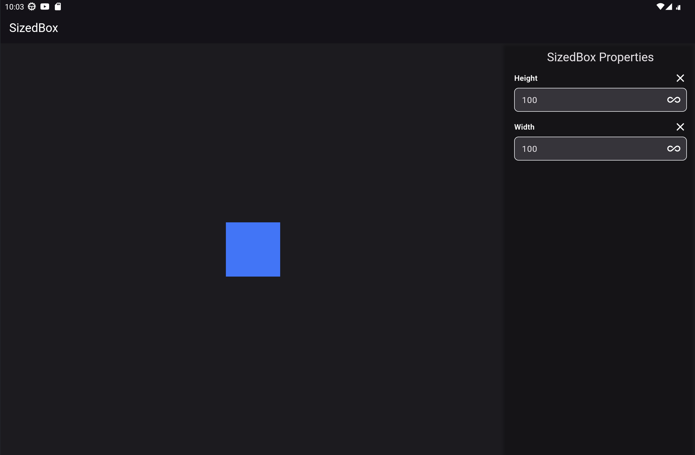
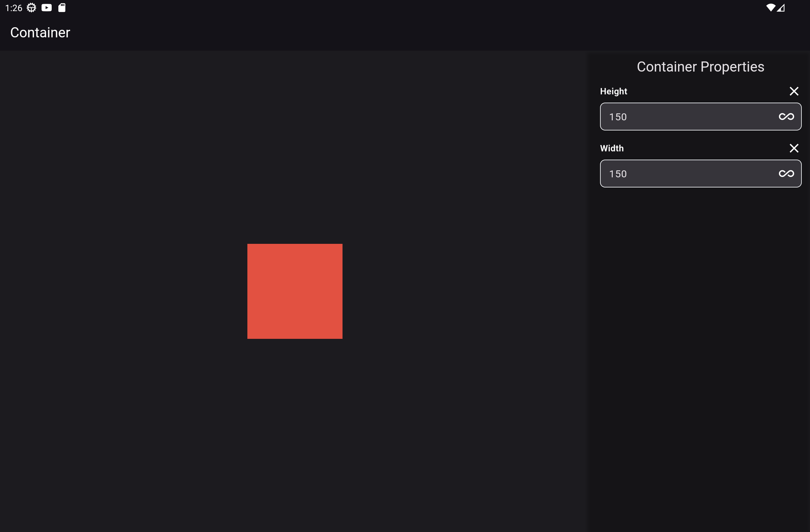
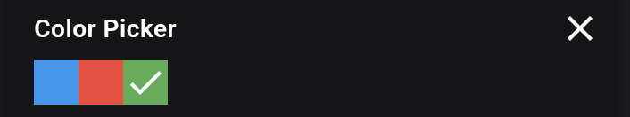
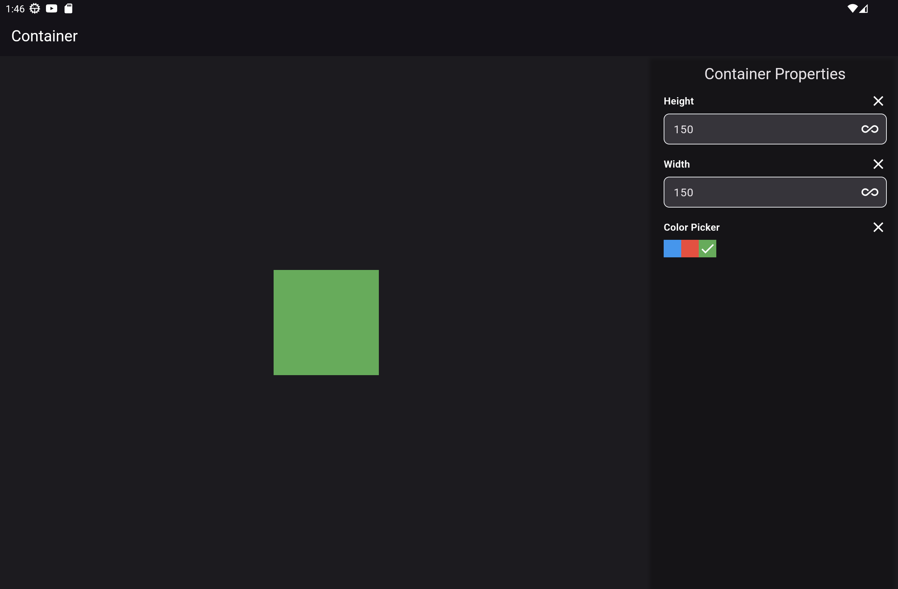

# Flutter Catalog: An Interactive Widget Explorer

Explore and understand Flutter widgets interactively. Modify widget properties in real-time and see how they behave. This is an interactive version of the [Flutter Widget Catalog](https://docs.flutter.dev/ui/widgets).

## Quick Look



The app has two main areas:

- **Canvas**: Displays a widget (e.g., `SizedBox`) for you to interact with.
- **Property Drawer**: Lists all adjustable properties of the widget on the canvas.

Change values in the property drawer and watch the widget on the canvas update in real-time.


## Get Started

### How to Add a New Widget for Exploration

1. Create a new Dart file under `lib/catalog/widgets`. Name it after the widget you're adding, like `container.dart`.
2. Inside this file, define a class like `ContainerPropertyExplorer`:

```dart
class ContainerPropertyExplorer extends StatelessWidget {
  const ContainerPropertyExplorer({Key? key}) : super(key: key);
  @override
  Widget build(BuildContext context) {
    return const Placeholder();
  }
}
```

3. Use `PropertyExplorerBuilder` to add widget-specific properties.  The `PropertyExplorerBuilder` is a full-screen tool that gives us a space to create our widget. It also organizes and controls the settings we can change in a side menu.

```dart
Widget build(BuildContext context) {
  return PropertyExplorerBuilder(
    widgetName: "Container",
    builder: (PropertyProvider provider) {
      // Access predefined property fields
      final height = provider.heightField();
      final width = provider.widthField();

      // Create your widget using these property values
      return Container(
        height: height,
        width: width,
        color: Colors.red,
      );
    },
  );
}
```
This will result in following screen. Having widget in center and properties in property drawer.

### How to Add a Custom Property Field
To add a new property for let's say picking colors, follow these steps:
1. Install `mason_cli` if you haven't:
```sh
dart pub global activate mason_cli
```
2. **Generate the Custom Field Template**: Run the `mason make property_field` command to create the template files for your custom property. You'll be prompted to enter information like the property name, its data type, and its default value.
```sh
mason make property_field
```
    
3. **Answer the Prompts**:
    - **Property Name**: For example, `ColorPicker`.
    - **Data Type**: The type of data your property handles, such as `Color`.
    - **Default Value**: A default value for the property, like `Colors.transparent`.
    - **Generate Widget?**: If you say yes, it will generate a Dart file where you can customize the widget.
4. **Implement the Custom Field Widget**: Mason will generate two files: one under `lib/property_fields/` and another under `lib/widgets/fields/`. Open the Dart file under `lib/widgets/fields/` to implement your custom field. This will contain following code.
```dart
import 'package:flutter/material.dart';  
  
class ColorPickerField extends StatelessWidget {  
  final void Function(Color) onChanged;  
  final Color value;  
  
  const ColorPickerField({  
    super.key,  
    required this.onChanged,  
    required this.value,  
  });  
  
  @override  
  Widget build(BuildContext context) {  
    //TODO: Implement widget here...  
    return const Placeholder();  
  }  
}
```
Here we can implement a simple color picker using color buttons which will look like following

```dart
class ColorPickerField extends StatelessWidget {
  final void Function(Color) onChanged;
  final Color value;
  
  const ColorPickerField({
    Key? key,
    required this.onChanged,
    required this.value,
  });

  @override
  Widget build(BuildContext context) {
    return Row(
      children: [
        buildColorButton(Colors.blue),
        buildColorButton(Colors.red),
        buildColorButton(Colors.green),
      ],
    );
  }

  GestureDetector buildColorButton(Color color) {
    return GestureDetector(
      onTap: () => onChanged(color),
      child: Container(
        color: color,
        height: 25,
        width: 25,
        child: value == color ? Icon(Icons.check) : null,
      ),
    );
  }
}

```

### How to Use Your Custom Property

1. **Import Extension**: After generating the files, you'll find an extension method added to `PropertyProvider` in the `lib/property_fields/` file.
```dart
extension ColorPickerFieldPropertyProvider on PropertyProvider {
  Color? colorPickerField(/* params */) {
    // Implementation
  }
}
```   
2. **Use in Widget**: You can use this extension method in your main widget file to generate the custom property field. Just call `provider.colorPickerField()` to include it.
```dart
Widget build(BuildContext context) {
  return PropertyExplorerBuilder(
    widgetName: "Container",
    builder: (PropertyProvider provider) {
      final height = provider.heightField();
      final width = provider.widthField();
      final color = provider.colorPickerField(
        id: 'colorPicker',
        title: 'Color Picker',
      );
    
      return Container(
        height: height,
        width: width,
        color: color,
      );
    },
  );
}
```   

And that's how you can create and utilize a custom property field in your Flutter project. This new property will be accessible from the property drawer, and you can interact with it just like any other predefined property.


Happy widget exploring!